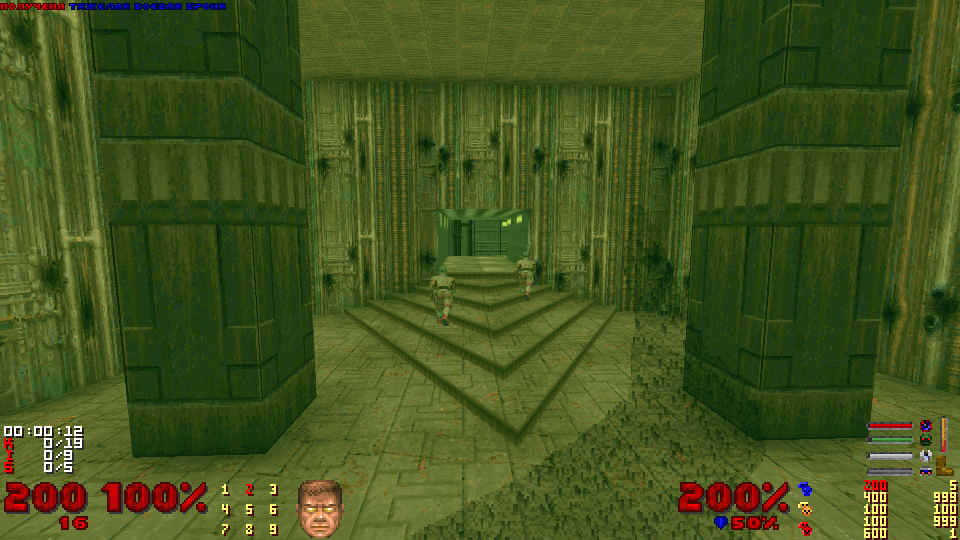
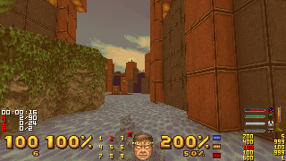
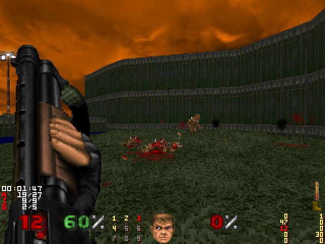

# crisper-hud
Crispy-like HUD for Brutal Doom v22. Inspired by [MimicHUD](https://www.doomworld.com/forum/topic/132081-gzhud-feel-at-home-when-using-gzdoom-thanks-to-mimichud/) by [liPillON](https://www.doomworld.com/profile/34495-lipillon/)

Font taken from [MimicHUD](https://github.com/liPillON/gzhud_mimic) too.

## Screenshots

